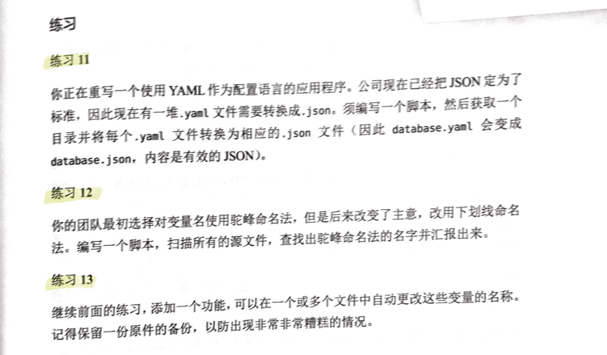

# 《程序员修炼之道（第2版）

这里是[程序员修炼之道（第二版）](https://book.douban.com/subject/35006892/)的练习。




## 练习11题 - YAML转换为JSON

将YAML转换为JSON。


### 思路

1. yaml的解析工具：[github.com/mikefarah/yq](https://github.com/mikefarah/yq)。通过`yq`对yaml文件进行解析、转化和输出。

   - 安装最新版本（v4）：`GO111MODULE=on go get -u -v github.com/mikefarah/yq/v4`
   - 输出json的命令：`yq eval ./yaml_files/y1.yaml -j`

2. 查找对应的目录的yaml文件（包含`yaml`或`yml`)

   ```bash
   find ./yaml_files -type f \( -iname '*.yaml' -o -name '*.yml' \)
   ```

   * `-type f` - 查找文件，不包含文件夹
   * `\( \)` - 组合参数，提供给 `-type f`
   * `-o` - OR表达式
   * `-iname` - 与`-name`类似，但是忽略大小写。

3. 将搜索结果进行处理：`find`命令增加参数：`[ -exec   -ok   command ]   {} \;`

   ```bash
   find ./yaml_files -type f \( -iname '*.yaml' -o -name '*.yml' \)
   ```


### 脚本

直接运行脚本：

```bash
bash ./yaml_to_json.sh
```

