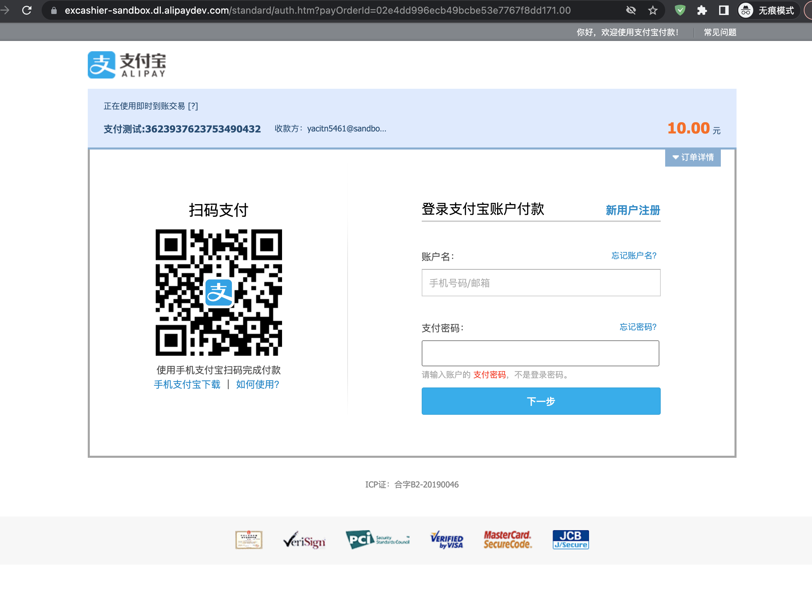

# 支付宝支付流程


1、注意事项


```go
const newGatewayAddr = "https://openapi-sandbox.dl.alipaydev.com/gateway.do"

alipay.New(kAppId, kPrivateKey, false,
    alipay.WithSandboxGateway(newGatewayAddr),  // 必须指定新的沙箱环境，否则默认会使用旧版本的网关
)
```


2、 运行

需要修改：

1. 沙箱环境相关的变量

2. 回调地址域名：我使用的是 ngrok 将内网 IP 映射到公网


```bash
go run .
```

3、测试

3.1、打开地址：http://localhost:9999/alipay/pay

3.2、支付：使用「沙箱环境」中的买家账号进行支付




